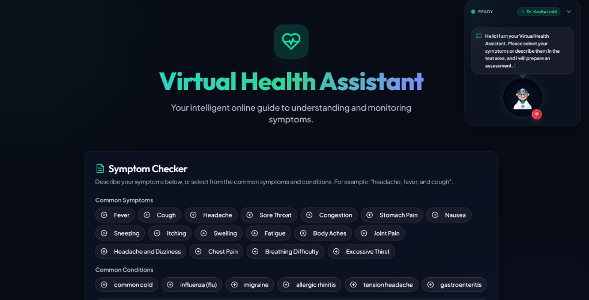
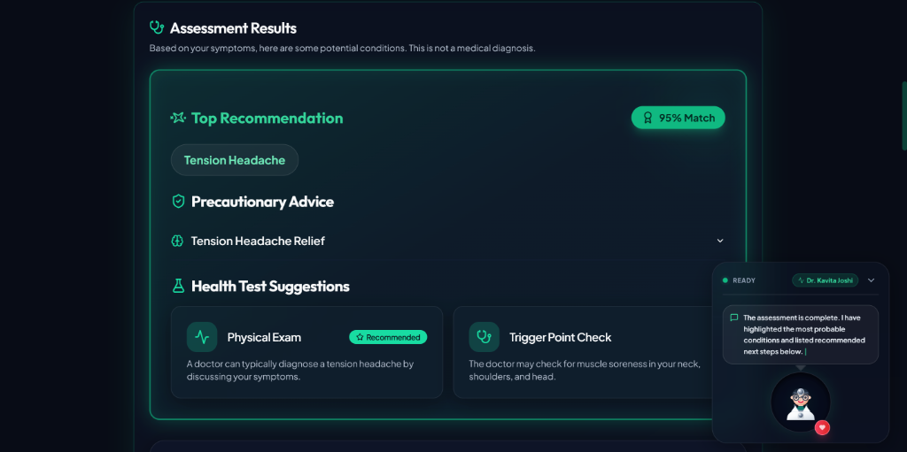

# 🩺 Virtual Health Assistant

An intelligent, AI-powered health companion built with React, Next.js, Google Genkit. It helps users analyze symptoms, discover potential conditions, access doctor-recommended care plans, and find specialists in their area.

---

### 🔗 Live Deployment
🚀 **[Access the Live App here](https://virtual-health-assistant-beige.vercel.app/)**  
*(Hosted on Vercel)*

---

## 🛠️ Technology Stack & Badges

| Layer | Technologies Used |
| :--- | :--- |
| **Frontend Framework** |   |
| **Styling & UI Components** |   |
| **AI Engine** |   |
| **Icons & Media** |  |
| **Deployment Platform** |  |

---

## 🌟 Key Features

*   🧠 **Intelligent Symptom Analysis**: Enter symptoms in natural language (e.g., *"headache, fever, and cough"*) or click quick-select tags to let Gemini assess potential health conditions.
*   💊 **Structured Care & Recovery Plans**: Each assessment outputs a detailed care checklist, including:
    *   *Medication Advice*: Safe over-the-counter directives.
    *   *Dietary Guidelines*: Specific, actionable food/drink suggestions.
    *   *Activity Levels*: Rest levels and exercise limits.
    *   *Emergency Warning Signs*: Red flags indicating when to seek immediate medical attention.
*   🛡️ **Smart Local Fallback**: Built-in keyword matching database detects conditions instantly even when offline or if the Gemini API key is missing or rate-limited.
*   🗂️ **Interactive Doctor Directory**: Browse mock medical professionals by specialty (e.g., General Medicine, Pediatrics, Cardiology, Neurology, Orthopedics) and simulate scheduling appointments.
*   💬 **Virtual Assistant Panel**: A conversational doctor panel ready to guide users through their healthcare queries.

---

## 📸 Screenshots & User Interface

### 1️⃣ Symptom Checker Dashboard
*A modern, dark-themed UI for typing symptom details and selecting pre-defined options.*


### 2️⃣ Assessment Results & Actionable Recovery Checklist
*AI-driven recommendations featuring likelihood percentages, precaution dropdowns, and clinical suggestions.*


---

## 🌍 Real-World Advantages & Impact

The Virtual Health Assistant solves critical pain points in modern healthcare triage:

1.  ⏱️ **Instant Preliminary Guidance**: Provides users with immediate information 24/7, reducing anxiety before they can consult a physician.
2.  🚨 **Life-Saving Red Flags**: Explicitly lists emergency warnings signs, advising users when to skip standard clinic bookings and head straight to emergency rooms.
3.  📉 **Optimized Healthcare Load**: Helps filter out minor, self-resolving concerns (like a common cold or mild tension headache) from severe ones, decreasing the patient burden on local hospitals and clinics.
4.  🎓 **Improved Patient Health Literacy**: Educates users on precautions, dietary recommendations, and activity adjustments, empowering them to make informed recovery choices.
5.  🗺️ **Seamless Integration with Professionals**: Instead of leaving users stranded after an online search, the app suggests relevant local specialists for physical consultations.

---

## 🚀 Local Development Setup

To run this project locally, follow these steps:

### 1. Prerequisites
Ensure you have **Node.js** (v18 or higher) installed on your system.

### 2. Clone and Install Dependencies
Navigate to the root directory and install dependencies:
```bash
npm install
```

### 3. Environment Configuration
Create a `.env` file in the root directory (or update the existing one) and add your Google Gemini API Key:
```env
GEMINI_API_KEY=your_gemini_api_key_here
```

### 4. Run Development Server
Start the Next.js development server:
```bash
npm run dev
```
Open [http://localhost:3000](http://localhost:3000) in your browser to view the application.

### 5. Production Build
To create a production-optimized build and run it:
```bash
npm run build
npm start
```

---

## 🛡️ Medical Disclaimer
> [!IMPORTANT]
> This application is a **demonstration prototype** and is **not intended for real medical use or diagnosis**. Always consult a qualified healthcare professional or seek emergency medical help if you are experiencing severe symptoms.
