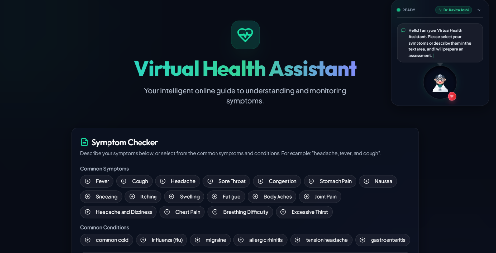
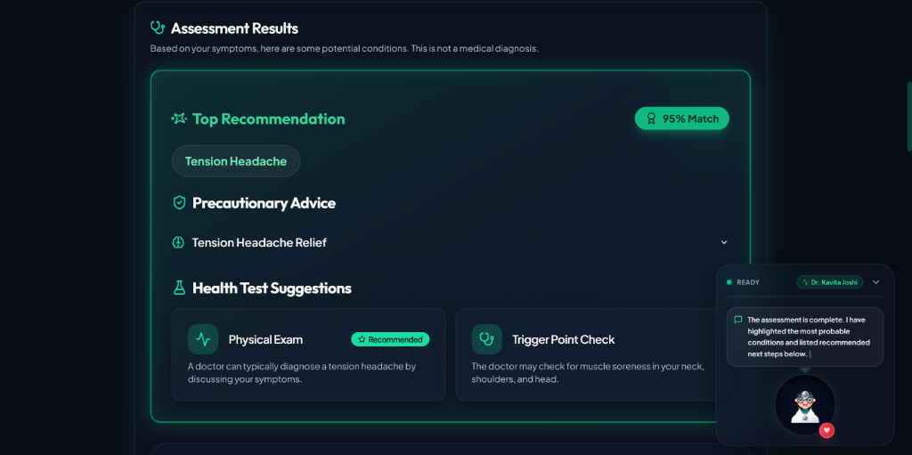

# 🩺 Virtual Health Assistant

An intelligent, AI-powered healthcare companion built with **Next.js 15**, **React 18**, **Express.js**, and **Google Gemini 2.5 Flash**. It empowers users to analyze symptoms through natural language, review potential medical conditions, receive tailored clinical recovery plans, schedule conflict-free appointments with certified local specialists, and consult an interactive virtual doctor assistant.

---

### 🔗 Live Deployment
🚀 **[Access the Live App here](https://virtual-health-assistant-beige.vercel.app/)**  
*(Hosted on Vercel)*

---

## 🛠️ Technology Stack & Badges

| Layer | Technologies Used |
| :--- | :--- |
| **Frontend Framework** |   |
| **Backend API & Server** |    |
| **Styling & Design System** |    |
| **AI Engine & Workflow** |   |
| **Data Persistence** |   |
| **PWA & Offline Support** |   |
| **Icons & Media** |  |
| **Deployment Platform** |  |

---

## 🌟 Key Features

*   🧠 **Intelligent Dual-Engine Symptom Analysis**: Input symptoms in natural language (e.g., *"severe headache, nausea, and sensitivity to light"*) or choose from quick-select symptom chips. Powered by **Gemini 2.5 Flash** with an automatic sub-15ms fallback to a 37+ condition clinical keyword matching engine.
*   👨‍⚕️ **Interactive Floating Doctor Assistant**:
    *   *Real-Time Typewriter Feedback*: Conversational responses updating dynamically as you describe symptoms, add tags, or run assessments.
    *   *Smart Screen Boundary Clamping*: Fully draggable across the viewport with mathematical clamping that prevents clipping off-screen.
    *   *Dynamic Scroll Docking*: Seamlessly transitions between an expanded upper-right card and a compact bottom-right floating pill when scrolling.
    *   *Auto-Reclamping on Expand*: Intelligently lifts upward when expanded near the bottom edge.
*   📋 **Structured Care & Recovery Plans**: Each assessment delivers an actionable recovery blueprint, complete with:
    *   *Primary & Differential Diagnoses*: Rated by likelihood percentages.
    *   *Prescription Directives*: Over-the-counter advice with safe usage limits.
    *   *Dietary Guidelines*: Specific foods, hydration, and nutritional advice.
    *   *Activity Adjustments*: Recommended rest schedules and exertion limits.
    *   *Emergency Red Flags*: Critical alerts signaling when immediate ER care is warranted.
*   🧪 **Diagnostic Test Suggestions**: Correlates detected conditions with relevant clinical examinations (e.g., CBC, MRI, Blood Glucose, RIDT).
*   🗂️ **Specialist Directory & Persistent Scheduling**:
    *   *Specialist Search*: Filter verified doctors across 7+ specialties and major Indian metropolitan hubs.
    *   *Conflict-Free Booking*: Real-time slot availability checking that blocks double-booking conflicts.
    *   *Persistent Confirmation*: Generates unique booking reference IDs (`VHA-XXXXXX`) stored persistently in the database.
*   💬 **Virtual Doctor AI Chatbot**: Real-time conversational triage with Dr. Amit Patel persona for lifestyle, medication, and symptom inquiries.
*   🛡️ **Production-Ready Backend API**: Complete modular Express server with request logging, sliding-window rate limiting, input sanitization, and health diagnostics.
*   📱 **Progressive Web App (PWA)**: Equipped with service worker caching for offline readiness and native-like desktop and mobile installation.

---

## 📸 Screenshots & User Interface

### 1️⃣ Symptom Checker Dashboard
*A sleek, dark-mode glassmorphic dashboard for logging symptoms with quick-add chips.*


### 2️⃣ Assessment Results & Actionable Recovery Checklist
*AI-driven health evaluations featuring condition likelihood meters, precautionary advice, and recommended local specialists.*


---

## 🏗️ Project Architecture

```
Virtual-Health-Assistant/
├── backend/                       # Dedicated Express Backend API
│   ├── config/                    # Environment & database drivers
│   │   ├── db.js                  # Persistent JSON storage with atomic writes
│   │   └── index.js               # Central config loader (port, CORS, Gemini key)
│   ├── controllers/               # Request handling & controller logic
│   │   ├── appointmentController.js
│   │   ├── chatController.js
│   │   ├── doctorController.js
│   │   ├── healthController.js
│   │   └── symptomController.js
│   ├── data/                      # Medical catalogs & persistent storage
│   │   ├── doctorData.js          # Verified specialist database
│   │   ├── medicalCatalog.js      # 37+ conditions, symptoms, tests & care plans
│   │   └── storage/               # JSON storage directory (appointments.json)
│   ├── middleware/                # Express middleware pipeline
│   │   ├── errorHandler.js        # Standardized JSON error response contract
│   │   ├── logger.js              # HTTP request & response time logger
│   │   ├── rateLimiter.js         # Sliding-window rate limiter
│   │   └── validate.js            # Input validation & schema checks
│   ├── routes/                    # REST API routes mounted at /api
│   │   ├── appointmentRoutes.js   # /api/appointments/*
│   │   ├── chatRoutes.js          # /api/chat/*
│   │   ├── doctorRoutes.js        # /api/doctors/*
│   │   ├── healthRoutes.js        # /api/health/*
│   │   ├── index.js               # Master API router
│   │   └── symptomRoutes.js       # /api/symptoms/*
│   ├── services/                  # Business logic & AI orchestration
│   │   ├── aiService.js           # Gemini 2.5 Flash API client
│   │   ├── appointmentService.js  # Booking & conflict prevention engine
│   │   ├── chatService.js         # Conversational clinical doctor service
│   │   ├── doctorService.js       # Doctor search & availability engine
│   │   └── symptomService.js      # Dual-engine triage & enrichment
│   ├── test/                      # Automated test suite
│   │   └── api.test.js            # 17-point integration test runner
│   ├── server.js                  # Main server entrypoint & graceful shutdown
│   ├── package.json               # Backend dependencies & scripts
│   └── README.md                  # Comprehensive backend API documentation
│
├── public/                        # Static assets, PWA icons, manifest & service worker
├── src/                           # Next.js Frontend (React 18 + Tailwind)
│   ├── ai/                        # Genkit AI workflows & Gemini prompts
│   ├── app/                       # Next.js App Router (Layout, Actions, Global CSS)
│   ├── components/                # Reusable UI & application components
│   │   ├── doctor-assistant.jsx   # Floating companion with boundary clamping
│   │   ├── doctor-details-dialog.jsx # Appointment booking modal with backend integration
│   │   ├── doctor-directory.jsx   # Searchable specialist directory
│   │   ├── prescribed-plan-card.jsx  # Structured care plan & checklist card
│   │   ├── symptom-checker-form.jsx  # Primary symptom input & triage flow
│   │   ├── test-suggestions.jsx   # Recommended diagnostic tests
│   │   └── ui/                    # Shadcn/Radix UI base primitives
│   └── lib/                       # Static data catalogs & utility helpers
└── package.json                   # Root manifest & unified scripts
```

---

## 📡 Backend REST API Reference

The backend operates as an independent REST API service under the `/api` namespace:

| Method | Endpoint | Description |
| :--- | :--- | :--- |
| `GET` | `/api/health` | Healthcheck, uptime, memory & AI service status |
| `GET` | `/api/health/info` | Catalog statistics & feature capabilities |
| `POST` | `/api/symptoms/assess` | AI clinical triage + recovery blueprint + test suggestions |
| `GET` | `/api/symptoms/catalog` | Categorized symptom chips taxonomy |
| `GET` | `/api/symptoms/conditions` | Supported medical conditions and mapped symptoms |
| `GET` | `/api/symptoms/tests/:condition` | Clinical examinations suggested for a condition |
| `GET` | `/api/doctors` | Query verified doctors (`?specialty=`, `?area=`, `?city=`) |
| `GET` | `/api/doctors/:id` | Doctor profile and credentials |
| `GET` | `/api/doctors/:id/slots` | Slot availability on specific date (`?date=YYYY-MM-DD`) |
| `POST` | `/api/doctors/search` | AI-assisted doctor search by area & specialty |
| `GET` | `/api/doctors/specialties` | Medical specialties directory with practitioner counts |
| `POST` | `/api/appointments` | Book appointment (prevents double-booking) |
| `GET` | `/api/appointments` | List appointments (`?patientPhone=...&status=...`) |
| `GET` | `/api/appointments/:id` | Lookup appointment by confirmation reference |
| `PATCH`| `/api/appointments/:id/cancel` | Cancel a scheduled appointment |
| `POST` | `/api/chat` | Virtual doctor conversational consultation |

*For complete request/response schemas and curl examples, see [backend/README.md](./backend/README.md).*

---

## 🚀 Local Development Setup

Follow these steps to run the frontend and backend locally:

### 1. Prerequisites
- **Node.js** (v18.0.0 or higher)
- **npm** (v9.0.0 or higher)

### 2. Clone the Repository & Install Dependencies
```bash
git clone https://github.com/monkeysoul-cmd/Virtual-Health-Assistant.git
cd Virtual-Health-Assistant
npm install
```

### 3. Environment Configuration
Create a `.env` file in the root directory (or copy from `.env.example`):
```env
GEMINI_API_KEY=your_google_gemini_api_key_here
PORT=5000
```
> *Tip: You can also enter and manage your Gemini API key directly from the in-app settings modal, which persists securely in your local browser storage.*

### 4. Start the Application

#### Option A: Run the Next.js Frontend
```bash
npm run dev
```
Open your browser and navigate to: `http://localhost:9002`

#### Option B: Run the Express Backend Server
```bash
# Production mode
npm run backend

# Watch mode (auto-reload on edits)
npm run backend:dev
```
Backend API will be accessible at: `http://localhost:5000`

---

## 🧪 Running Automated Tests

Run the built-in 17-point backend integration test suite:
```bash
npm test --prefix backend
# or
node backend/test/api.test.js
```

**Test Suite Coverage:**
```
🚀 Starting Virtual Health Assistant Backend Test Suite...
  ✅ PASS: GET / returns online status
  ✅ PASS: GET /api/health returns healthy
  ✅ PASS: GET /api/health/info returns doctor catalog stats
  ✅ PASS: GET /api/symptoms/catalog returns symptoms list
  ✅ PASS: GET /api/symptoms/conditions returns conditions
  ✅ PASS: GET /api/symptoms/tests/:condition returns diagnostic tests
  ✅ PASS: POST /api/symptoms/assess returns conditions with prescribed care plan
  ✅ PASS: GET /api/doctors filters by specialty
  ✅ PASS: GET /api/doctors/1 returns Dr. Priya Sharma
  ✅ PASS: GET /api/doctors/specialties returns specialties list
  ✅ PASS: GET /api/doctors/1/slots returns slot availability
  ✅ PASS: POST /api/doctors/search finds doctors in Indirapuram
  ✅ PASS: POST /api/appointments confirms booking and generates reference code
  ✅ PASS: POST /api/appointments prevents double-booking on same slot and date
  ✅ PASS: GET /api/appointments/:id retrieves booked appointment
  ✅ PASS: PATCH /api/appointments/:id/cancel successfully marks appointment cancelled
  ✅ PASS: POST /api/chat receives clinical conversational response from Dr. Patel

======================================================
📊 Test Results: 17 Passed, 0 Failed
======================================================
```

---

## 🌍 Real-World Advantages & Healthcare Triage Impact

1.  ⏱️ **24/7 Immediate Triage**: Delivers rapid preliminary health intelligence, curbing panic and providing informed steps before visiting a clinic.
2.  🚨 **Critical Emergency Detection**: Highlights red-flag symptoms prominently, instructing patients to seek emergency medical attention without delay.
3.  📉 **Mitigating Clinic Congestion**: Filters self-limiting conditions from urgent health concerns, reducing unnecessary pressure on primary care facilities.
4.  🎓 **Empowering Health Literacy**: Translates complex medical conditions into practical lifestyle, hydration, and recovery guidelines.
5.  🗺️ **Direct Specialist Routing**: Guides patients toward the appropriate medical specialty based on their individual symptom profile.

---

## 🛡️ Medical Disclaimer
> [!IMPORTANT]
> This application is a **demonstration and educational prototype** and is **not intended to replace professional medical advice, diagnosis, or treatment**. Always seek the advice of a qualified physician or other licensed healthcare provider with any questions you may have regarding a medical condition. Never disregard professional medical advice or delay seeking it because of information provided by this application.
